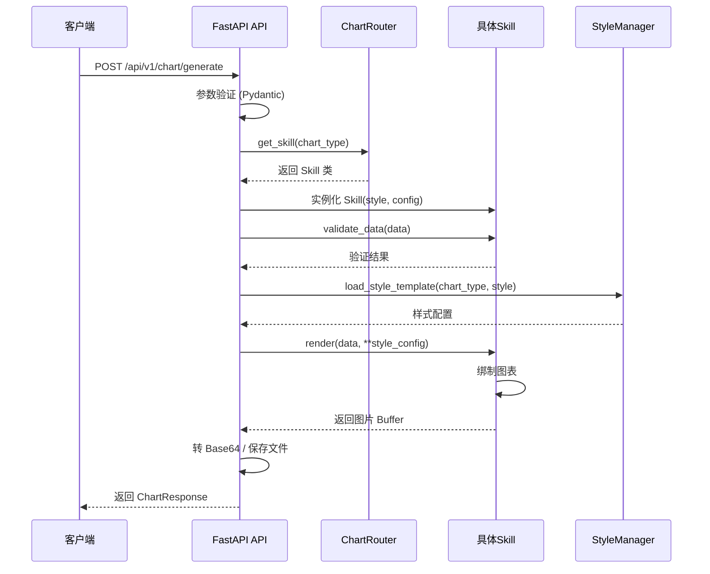

# Neo_Legend_Project 详细实施计划书

## 📋 项目概述

基于 README.md 的需求，本项目旨在使用 Python FastAPI 构建一个专业的体育数据可视化 API 服务，能够绘制多种类型的图表（类似于 Kirk Goldsberry 风格的篮球数据可视化）。

## 🎯 核心需求分析

### 图形类型分类

根据提供的示例图片，需要实现以下 **6 大类图形**：

#### 1️⃣ **球场投射图 (Shooting Terrain/Chart)**
- **特征**：
  - 3D 地形热力图效果
  - 篮球场地轮廓线
  - 颜色渐变表示投篮频率/效率
  - 深色背景（黑色）
  - 球员名称和赛季信息标题
  - 支持多种样式变体（7张不同示例）
  
- **技术实现**：
  - 使用 matplotlib + numpy 绘制 3D 表面图
  - 六边形网格插值（hexbin）
  - 自定义颜色映射（红-灰渐变）

#### 2️⃣ **双球场投射图 (Dual Court Comparison)**
- **特征**：
  - 上下两个球场并排显示
  - 对比不同时期/球员的数据
  - 显示 FG%、3P%、eFG% 等统计指标
  - "MOST IMPROVED" 等标签标注
  
- **技术实现**：
  - 子图布局（subplot 2x1）
  - 数据标准化处理
  - 差异高亮显示

#### 3️⃣ **球场投射动态图 (Animated Shooting Chart)**
- **特征**：
  - GIF 动画格式
  - 3D 透视视角的篮球场
  - 投篮轨迹动画（抛物线）
  - 球员头像和信息展示
  
- **技术实现**：
  - matplotlib.animation 或 Pillow GIF 生成
  - 3D 轨迹计算
  - 帧序列渲染

#### 4️⃣ **坐标散点图 (Scatter Plot)**
- **特征**：
  - 二维坐标系（X/Y轴）
  - 气泡大小表示数据量
  - 颜色编码表示类别
  - 球员名字标签
  - 参考线（如平均值线）
  
- **技术实现**：
  - matplotlib scatter plot
  - 大小和颜色映射
  - 注释文本优化

#### 5️⃣ **正负坐标四象限图 (Quadrant Chart)**
- **特征**：
  - 四象限划分
  - X/Y 轴分别表示不同指标（进攻/防守效率）
  - 球队 logo 或球员头像
  - 象限标签（TWINNING, QUADRANT OF WOW 等）
  - 对角参考线
  
- **技术实现**：
  - 自定义坐标轴
  - 图像叠加（logo/头像）
  - 文本标注系统

#### 6️⃣ **数据表格图 (Data Table)**
- **特征**：
  - 结构化表格展示
  - 球员头像列
  - 彩色单元格背景（条件格式）
  - 多列统计数据
  - 排名和数值对比
  
- **技术实现**：
  - matplotlib table 或 pandas Styler
  - HTML/CSS 渲染转图片
  - 渐变色背景逻辑

---

## 🏗️ 系统架构设计

### 项目结构
```
Neo_Legend_Project/
├── app/
│   ├── __init__.py
│   ├── main.py                 # FastAPI 主应用入口
│   ├── config.py               # 配置管理
│   ├── models/
│   │   ├── __init__.py
│   │   ├── schemas.py          # Pydantic 数据模型
│   │   └── enums.py            # 枚举类型定义
│   ├── skills/
│   │   ├── __init__.py
│   │   ├── base_skill.py       # Skill 基类
│   │   ├── court_shooting/
│   │   │   ├── __init__.py
│   │   │   ├── shooting_terrain.py      # 球场投射图
│   │   │   ├── dual_court.py            # 双球场对比图
│   │   │   └── animated_shooting.py     # 动态投射图
│   │   ├── charts/
│   │   │   ├── __init__.py
│   │   │   ├── scatter_plot.py          # 坐标散点图
│   │   │   ├── quadrant_chart.py        # 四象限图
│   │   │   └── rose_chart.py            # 玫瑰图
│   │   └── tables/
│   │       ├── __init__.py
│   │       ├── stats_table.py           # 统计表格
│   │       └── comparison_table.py      # 对比表格
│   ├── services/
│   │   ├── __init__.py
│   │   ├── chart_router.py              # 图表路由服务（自动选择组件）
│   │   └── style_manager.py             # 样式管理器
│   ├── utils/
│   │   ├── __init__.py
│   │   ├── image_utils.py               # 图片处理工具
│   │   ├── color_palette.py             # 颜色调色板
│   │   └── basketball_court.py          # 篮球场地绘制工具
│   └── templates/                        # 样式模板配置
│       ├── court_styles.json
│       ├── chart_styles.json
│       └── table_styles.json
├── tests/
│   ├── __init__.py
│   ├── conftest.py                       # 测试 fixtures
│   ├── test_api_endpoint.py              # API 接口测试
│   ├── test_skills/
│   │   ├── test_court_shooting.py        # 球场投射图测试
│   │   ├── test_dual_court.py            # 双球场图测试
│   │   ├── test_animated_shooting.py     # 动态图测试
│   │   ├── test_scatter_plot.py          # 散点图测试
│   │   ├── test_quadrant_chart.py        # 四象限图测试
│   │   ├── test_rose_chart.py            # 玫瑰图测试
│   │   └── test_tables.py                # 表格图测试
│   └── test_auto_selection.py            # 自动选择组件测试
├── requirements.txt
├── Dockerfile
├── .env.example
└── README.md
```

---

## 🔧 技术栈选择

### 后端框架
- **FastAPI**: 高性能异步 Web 框架
- **Uvicorn**: ASGI 服务器
- **Pydantic**: 数据验证和设置管理

### 数据可视化库
- **Matplotlib**: 核心绑图引擎（2D/3D 图表）
- **NumPy**: 数值计算和数据处理
- **Pandas**: 数据操作和分析
- **Pillow (PIL)**: 图片处理和 GIF 生成
- **Seaborn**: 统计可视化增强（可选）

### 辅助工具
- **python-multipart**: 文件上传支持
- **httpx**: 异步 HTTP 客户端（测试用）
- **pytest**: 测试框架
- **pytest-asyncio**: 异步测试支持

---

## 📐 API 接口设计

### 主接口：`POST /api/v1/chart/generate`

#### 请求参数
```python
class ChartRequest(BaseModel):
    chart_type: ChartType           # 图例类型（必填）
    style: ChartStyle               # 图例样式（必填）
    data: dict                      # 图例数据（必填）
    title: Optional[str] = None     # 标题（可选）
    subtitle: Optional[str] = None  # 副标题（可选）
    output_format: OutputFormat = OutputFormat.PNG  # 输出格式
    width: int = 1200               # 图片宽度
    height: int = 800               # 图片高度
    dpi: int = 150                  # 分辨率
    custom_params: Optional[dict] = None  # 自定义参数
```

#### 枚举类型定义
```python
class ChartType(str, Enum):
    SHOOTING_TERRAIN = "shooting_terrain"        # 球场投射图
    DUAL_COURT = "dual_court"                     # 双球场投射图
    ANIMATED_SHOOTING = "animated_shooting"       # 动态投射图
    SCATTER_PLOT = "scatter_plot"                 # 坐标散点图
    QUADRANT_CHART = "quadrant_chart"             # 四象限图
    ROSE_CHART = "rose_chart"                     # 玫瑰图
    STATS_TABLE = "stats_table"                   # 统计表格
    COMPARISON_TABLE = "comparison_table"         # 对比表格

class ChartStyle(str, Enum):
    # 球场投射图样式
    GOLDSBERRY_CLASSIC = "goldsberry_classic"     # 经典 Kirk Goldsberry 风格
    DARK_THEME = "dark_theme"                     # 暗色主题
    LIGHT_THEME = "light_theme"                   # 亮色主题
    HEXAGONAL = "hexagonal"                       # 六边形网格
    HEATMAP = "heatmap"                           # 热力图模式
    
    # 散点图样式
    BUBBLE_CHART = "bubble_chart"                 # 气泡图
    DENSITY_SCATTER = "density_scatter"           # 密度散点
    
    # 四象限图样式
    TEAM_LOGO = "team_logo"                       # 团队 Logo 版本
    PLAYER_PHOTO = "player_photo"                 # 球员照片版本
    
    # 表格样式
    RANKING_TABLE = "ranking_table"               # 排名表格
    COMPARISON_CARD = "comparison_card"           # 对比卡片
```

#### 响应格式
```python
class ChartResponse(BaseModel):
    success: bool
    chart_type: ChartType
    style: ChartStyle
    image_url: str                    # 生成的图片 URL 或 Base64
    metadata: dict                    # 元数据（生成时间、尺寸等）
    download_url: str                 # 下载链接
```

### 辅助接口

#### 1. 获取支持的图表类型
`GET /api/v1/chart/types`

返回所有可用的图表类型及其描述、支持样式列表

#### 2. 获取样式模板
`GET /api/v1/chart/styles/{chart_type}`

返回指定图表类型支持的所有样式及参数说明

#### 3. 健康检查
`GET /api/v1/health`

服务状态检查

---

## ⚙️ 核心模块详细设计

### 1. Skill 基类架构 (`base_skill.py`)

```python
from abc import ABC, abstractmethod
from typing import Dict, Any, Optional
import matplotlib.pyplot as plt
from io import BytesIO
import base64

class BaseSkill(ABC):
    """Skill 抽象基类"""
    
    def __init__(self, style: str, config: Dict[str, Any]):
        self.style = style
        self.config = config
        self.fig = None
        self.ax = None
    
    @abstractmethod
    def validate_data(self, data: Dict) -> bool:
        """验证输入数据格式"""
        pass
    
    @abstractmethod
    def render(self, data: Dict, **kwargs) -> BytesIO:
        """渲染图表"""
        pass
    
    @abstractmethod
    def get_supported_styles(self) -> list:
        """获取支持的样式列表"""
        pass
    
    def apply_style_template(self):
        """应用样式模板"""
        pass
    
    def save_to_buffer(self, format: str = 'png', dpi: int = 150) -> BytesIO:
        """保存到内存缓冲区"""
        buffer = BytesIO()
        self.fig.savefig(buffer, format=format, dpi=dpi, 
                        bbox_inches='tight', facecolor=self.config.get('bgcolor', 'black'))
        buffer.seek(0)
        return buffer
    
    def to_base64(self, buffer: BytesIO) -> str:
        """转换为 Base64 编码"""
        return base64.b64encode(buffer.getvalue()).decode('utf-8')
```

### 2. 自动组件选择器 (`chart_router.py`)

```python
from typing import Dict, Type
from app.skills.base_skill import BaseSkill
from app.skills.court_shooting.shooting_terrain import ShootingTerrainSkill
# ... 导入其他 skills

class ChartRouter:
    """自动路由到对应的 Skill 组件"""
    
    _skill_registry: Dict[ChartType, Type[BaseSkill]] = {
        ChartType.SHOOTING_TERRAIN: ShootingTerrainSkill,
        ChartType.DUAL_COURT: DualCourtSkill,
        ChartType.ANIMATED_SHOOTING: AnimatedShootingSkill,
        ChartType.SCATTER_PLOT: ScatterPlotSkill,
        ChartType.QUADRANT_CHART: QuadrantChartSkill,
        ChartType.ROSE_CHART: RoseChartSkill,
        ChartType.STATS_TABLE: StatsTableSkill,
        ChartType.COMPARISON_TABLE: ComparisonTableSkill,
    }
    
    @classmethod
    def get_skill(cls, chart_type: ChartType) -> Type[BaseSkill]:
        """根据图表类型获取对应的 Skill 类"""
        skill_class = cls._skill_registry.get(chart_type)
        if not skill_class:
            raise ValueError(f"Unsupported chart type: {chart_type}")
        return skill_class
    
    @classmethod
    def register_skill(cls, chart_type: ChartType, skill_class: Type[BaseSkill]):
        """注册新的 Skill（支持扩展）"""
        cls._skill_registry[chart_type] = skill_class
```

### 3. 核心业务流程



---

## 🎨 各 Skill 详细实现方案

### Skill 1: ShootingTerrainSkill（球场投射图）

#### 功能特性
- ✅ 单个球场的投篮热力图
- ✅ 3D 地形效果（可选）
- ✅ 六边形或矩形网格
- ✅ 多种颜色映射方案
- ✅ 篮球场地轮廓精确绘制
- ✅ 区域命中率标注

#### 关键实现细节
```python
class ShootingTerrainSkill(BaseSkill):
    """
    Kirk Goldsberry 风格投篮热力图
    
    数据格式要求:
    {
        "player_name": "Scottie Pippen",
        "season": "1997-98",
        "shots": [
            {"x": 5.2, "y": 10.3, "made": true},
            {"x": -3.1, "y": 8.7, "made": false},
            ...
        ]
    }
    """
    
    def render(self, data: Dict, **kwargs) -> BytesIO:
        # 1. 创建画布（黑色背景）
        self.fig, self.ax = plt.subplots(figsize=(12, 11), facecolor='black')
        self.ax.set_facecolor('black')
        
        # 2. 绘制篮球场地
        self._draw_court()
        
        # 3. 处理投篮数据
        shots_df = pd.DataFrame(data['shots'])
        
        # 4. 计算六边形网格统计
        hb = self.ax.hexbin(
            shots_df['x'], shots_df['y'],
            C=shots_df['made'].astype(int),
            gridsize=30,
            cmap=self._get_colormap(),
            mincnt=1
        )
        
        # 5. 添加标题和元信息
        self._add_title(data['player_name'], data['season'])
        
        # 6. 添加区域效率标签
        self._add_zone_labels(shots_df)
        
        return self.save_to_buffer()
```

#### 样式变体支持
- `goldsberry_classic`: 经典红-灰色调，3D 效果
- `dark_theme`: 纯黑背景，高亮热点
- `heatmap`: 传统热力图色彩（蓝-黄-红）
- `hexagonal`: 强调六边形边界

---

### Skill 2: DualCourtSkill（双球场投射图）

#### 功能特性
- ✅ 上下双球场布局
- ✅ 两份数据对比
- ✅ 统一颜色映射范围
- ✅ 差异显著性标记
- ✅ 统计摘要面板

#### 实现要点
```python
class DualCourtSkill(BaseSkill):
    def render(self, data: Dict, **kwargs) -> BytesIO:
        # 创建 2 行 1 列子图
        self.fig, (ax1, ax2) = plt.subplots(2, 1, figsize=(12, 16))
        
        # 数据集 1（上方）
        self._render_single_court(ax1, data['season_1'], title=f"{data['season_1']['label']}")
        
        # 数据集 2（下方）
        self._render_single_court(ax2, data['season_2'], title=f"{data['season_2']['label']}")
        
        # 添加改进标记
        if data.get('most_improved'):
            self._add_improvement_badge(ax2)
            
        # 添加统计面板
        self._add_stats_panel(data)
        
        return self.save_to_buffer()
```

---

### Skill 3: AnimatedShootingSkill（动态投射图）

#### 功能特性
- ✅ GIF 动画输出
- ✅ 3D 透视视角
- ✅ 投篮轨迹动画
- ✅ 粒子效果
- ✅ 可配置帧率和时长

#### 技术方案
```python
class AnimatedShootingSkill(BaseSkill):
    def render(self, data: Dict, **kwargs) -> BytesIO:
        from matplotlib.animation import FuncAnimation, PillowWriter
        
        fig = plt.figure(figsize=(14, 10))
        ax = fig.add_subplot(111, projection='3d')
        
        # 初始化 3D 篮球场
        self._setup_3d_court(ax)
        
        # 动画函数
        def animate(frame):
            ax.clear()
            self._setup_3d_court(ax)
            # 逐帧绘制投篮轨迹
            self._draw_trajectory_frame(ax, data['shots'], frame)
        
        # 创建动画
        anim = FuncAnimation(fig, animate, frames=100, interval=50)
        
        # 保存为 GIF
        buffer = BytesIO()
        writer = PillowWriter(fps=20)
        anim.save(buffer, writer=writer, dpi=100)
        buffer.seek(0)
        
        return buffer
```

---

### Skill 4: ScatterPlotSkill（坐标散点图）

#### 功能特性
- ✅ 气泡大小映射
- ✅ 颜色分类编码
- ✅ 智能标签避让
- ✅ 参考线系统
- ✅ 多维度数据支持

#### 数据格式
```json
{
  "title": "NBA Scorers",
  "subtitle": "Volume And Efficiency | March 8, 2023",
  "x_axis": {"label": "Field Goal Attempts Per 100 Possessions", "min": 18, "max": 32},
  "y_axis": {"label": "eFG%", "min": 46, "max": 66},
  "reference_line": {"y": 54, "label": "League Avg eFG%"},
  "points": [
    {"name": "Nikola Jokic", "x": 21.2, "y": 65.3, "size": 400, "color": "#FDB927", "team": "DEN"},
    ...
  ]
}
```

---

### Skill 5: QuadrantChartSkill（四象限图）

#### 功能特性
- ✅ 自定义四象限边界
- ✅ X/Y 轴独立配置
- ✅ Logo/头像叠加
- ✅ 象限区域着色
- ✅ 对角趋势线

#### 特色功能
- 支持 NBA球队 Logo 叠加
- 支持球员头像圆形裁剪
- 象限文字标注（TWINNING, QUADRANT OF WOW 等）

---

### Skill 6 & 7: Table Skills（表格图）

#### StatsTableSkill 特性
- ✅ 条件格式化单元格
- ✅ 渐变色背景
- ✅ 头像列集成
- ✅ 排序和高亮最佳值
- ✅ 多级表头

#### ComparisonTableSkill 特性
- ✅ 并排对比（常规赛季 vs 季后赛）
- ✅ 差异箭头指示
- ✅ 卡片式布局
- ✅ 进步/退步标记

---

## 🧪 测试策略

### 测试覆盖范围

#### 1. 单元测试 (Unit Tests)
- 每个 Skill 的 `validate_data()` 方法测试
- 边界条件和异常输入测试
- 颜色计算和坐标转换准确性测试

#### 2. 集成测试 (Integration Tests)
- API 端到端测试
- Skill 注册和路由机制测试
- 样式加载和应用测试

#### 3. 视觉回归测试 (Visual Regression Tests)
- 使用 `pytest-mpl` 或自定义对比工具
- 将生成的图片与基准图片对比
- 像素级别差异检测（允许阈值内误差）

### 测试用例清单

#### `test_court_shooting.py` (预计 15+ 用例)
```python
class TestShootingTerrainSkill:
    def test_valid_data_structure():
        """测试有效数据结构"""
        
    def test_empty_shots_array():
        """测试空投篮数据"""
        
    def test_single_zone_efficiency():
        """测试单区域效率计算"""
        
    def test_color_mapping_correctness():
        """测试颜色映射正确性"""
        
    def test_court_dimensions_accuracy():
        """测试球场尺寸精度"""
        
    def test_output_image_dimensions():
        """测试输出图片尺寸"""
        
    def test_different_style_variants():
        """测试不同样式变体"""
        # goldsberry_classic
        # dark_theme
        # heatmap
        # hexagonal
        
    def test_title_and_metadata_rendering():
        """测试标题和元数据渲染"""
        
    def test_high_density_data_performance():
        """测试高密度数据性能（1000+ 投篮）"""
```

#### 其他测试文件类似结构...

### 测试数据准备
- 在 `tests/fixtures/` 目录下准备 JSON 格式的测试数据
- 包含真实场景的简化版本
- 覆盖正常、边界、异常情况

---

## 📦 依赖管理和环境配置

### requirements.txt
```
fastapi==0.104.1
uvicorn[standard]==0.24.0
pydantic==2.5.2
pydantic-settings==2.1.0
matplotlib==3.8.2
numpy==1.26.2
pandas==2.1.3
Pillow==10.1.0
seaborn==0.13.0
python-multipart==0.0.6
httpx==0.25.2
pytest==7.4.3
pytest-asyncio==0.21.1
pytest-cov==4.1.0
```

### .env.example
```
APP_NAME=Neo Legend Chart API
DEBUG=True
HOST=0.0.0.0
PORT=8000
OUTPUT_DIR=./outputs
MAX_IMAGE_SIZE=10MB
ALLOWED_FORMATS=PNG,JPEG,GIF,SVG
CORS_ORIGINS=*
```

---

## 🚀 实施步骤和时间规划

### Phase 1: 项目基础搭建 (第1-2天)
- [ ] 初始化项目结构和虚拟环境
- [ ] 配置 FastAPI 应用骨架
- [ ] 定义 Pydantic 数据模型和枚举
- [ ] 实现 BaseSkill 抽象基类
- [ ] 创建 ChartRouter 自动路由器
- [ ] 编写基础配置管理系统

### Phase 2: 核心绘图工具开发 (第3-4天)
- [ ] 开发 `basketball_court.py`（篮球场地绘制工具）
- [ ] 实现 `color_palette.py`（颜色管理系统）
- [ ] 开发 `image_utils.py`（图片处理工具）
- [ ] 创建样式模板 JSON 文件
- [ ] 实现 StyleManager 样式管理器

### Phase 3: 球场投射图 Skills (第5-7天)
- [ ] 实现 ShootingTerrainSkill（主球场投射图）
- [ ] 实现 DualCourtSkill（双球场对比图）
- [ ] 实现 AnimatedShootingSkill（动态GIF图）
- [ ] 为每个 Skill 编写完整测试用例
- [ ] 视觉回归测试基准建立

### Phase 4: 图表 Skills 开发 (第8-9天)
- [ ] 实现 ScatterPlotSkill（散点图）
- [ ] 实现 QuadrantChartSkill（四象限图）
- [ ] 实现 RoseChartSkill（玫瑰图）
- [ ] 编写对应测试套件

### Phase 5: 表格 Skills 开发 (第10-11天)
- [ ] 实现 StatsTableSkill（统计表格）
- [ ] 实现 ComparisonTableSkill（对比表格）
- [ ] 优化表格渲染性能
- [ ] 表格样式微调

### Phase 6: API 集成和完善 (第12-13天)
- [ ] 完善 API 接口文档（Swagger UI）
- [ ] 实现辅助接口（/types, /styles, /health）
- [ ] 添加请求验证和错误处理
- [ ] 实现图片缓存机制
- [ ] 性能优化和并发处理

### Phase 7: 测试和质量保证 (第14-15天)
- [ ] 运行完整测试套件
- [ ] 修复发现的 Bug
- [ ] 代码审查和重构
- [ ] 生成测试覆盖率报告
- [ ] 准备部署配置（Docker）

### Phase 8: 文档和交付 (第16天)
- [ ] 编写 API 使用文档
- [ ] 创建示例代码和教程
- [ ] 性能基准测试报告
- [ ] 最终验收测试

---

## 🔒 设计原则和最佳实践

### 1. **单一职责原则 (SRP)**
- 每个 Skill 只负责一种图表类型的绘制
- 样式管理与业务逻辑分离
- 数据验证与渲染分离

### 2. **开闭原则 (OCP)**
- 通过继承 BaseSkill 扩展新图表类型
- 通过注册机制添加新样式
- 不修改已有代码即可扩展功能

### 3. **依赖倒置 (DI)**
- Skill 依赖于抽象基类而非具体实现
- 通过配置注入样式和数据源
- 易于单元测试和 Mock

### 4. **防御性编程**
- 所有输入数据严格验证
- 优雅的错误处理和友好的错误消息
- 资源释放（关闭文件句柄、清理内存）

### 5. **性能考虑**
- 大数据集分块处理
- 图片生成使用内存缓冲区（避免磁盘 I/O）
- 可选的异步处理队列
- 缓存常用图表

---

## 📊 扩展性和未来规划

### 可扩展功能
- [ ] 支持更多运动项目（足球、网球等）
- [ ] 实时数据流接入（WebSocket）
- [ ] 用户自定义样式上传
- [ ] 图表交互式探索（前端集成）
- [ ] 批量生成和导出
- [ ] 国际化（i18n）支持

### 监控和运维
- [ ] Prometheus 指标暴露
- [ ] 请求日志和审计
- [ ] 图片生成耗时监控
- [ ] 错误率告警

---

## ✅ 验收标准

### 功能完整性
- [ ] 所有 6 大类图表均可成功生成
- [ ] 每种图表至少支持 3 种样式变体
- [ ] API 接口响应时间 < 2秒（简单图表）< 5秒（复杂图表）
- [ ] 测试覆盖率 > 85%

### 质量标准
- [ ] 生成的图片与示例图视觉一致性 > 90%
- [ ] 无内存泄漏（长时间运行稳定）
- [ ] 代码符合 PEP 8 规范
- [ ] 完整的 API 文档（Swagger）

### 性能指标
- [ ] 并发支持：至少 50 并发请求
- [ ] 图片尺寸可配置（最大 4096x4096）
- [ ] 支持 PNG/JPEG/GIF/SVG 格式输出

---

## 📝 总结

本计划书提供了一个完整的、可执行的实施方案，涵盖了从项目架构、技术选型、详细设计到测试策略的所有方面。核心亮点包括：

1. **模块化的 Skill 架构**：每种图表类型独立封装，易于维护和扩展
2. **智能路由机制**：根据 `chart_type` 参数自动选择合适的绘图组件
3. **丰富的样式系统**：每种图表支持多种视觉风格，满足不同场景需求
4. **完善的测试体系**：单元测试、集成测试、视觉回归测试三重保障
5. **生产就绪**：考虑了性能、安全、监控等生产环境需求

按照此计划执行，可在 **16 个工作日** 内完成高质量的可交付成果。
