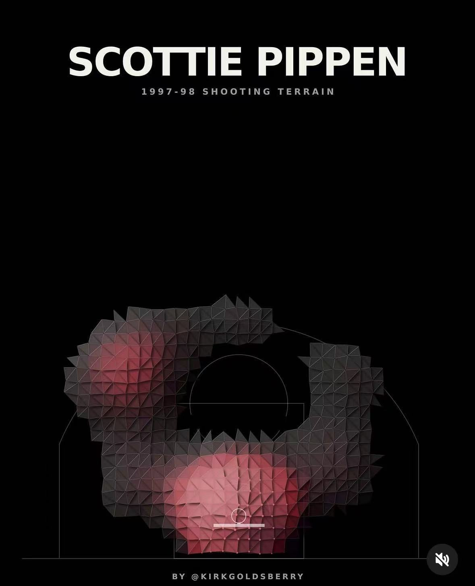
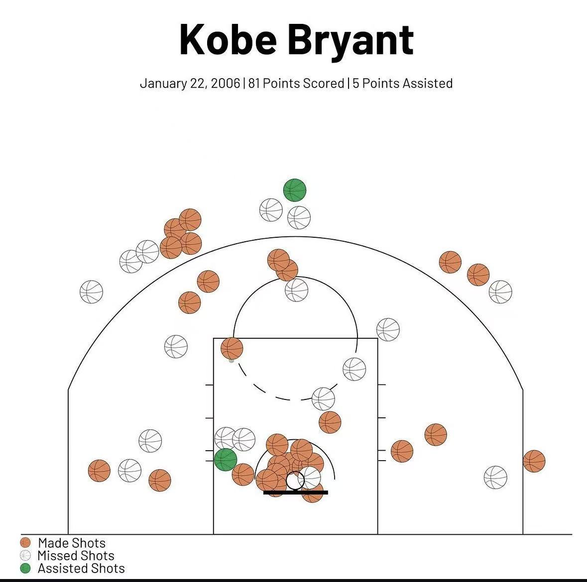
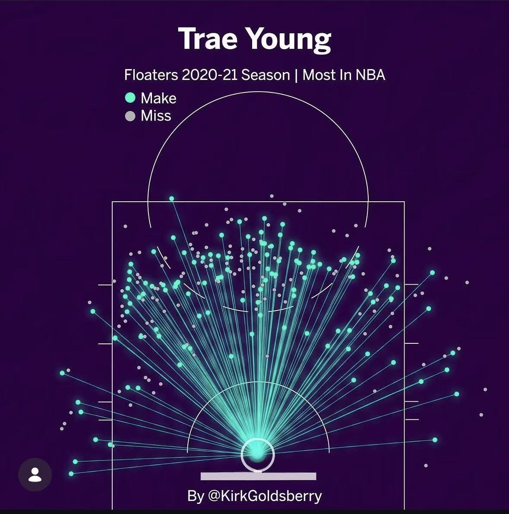
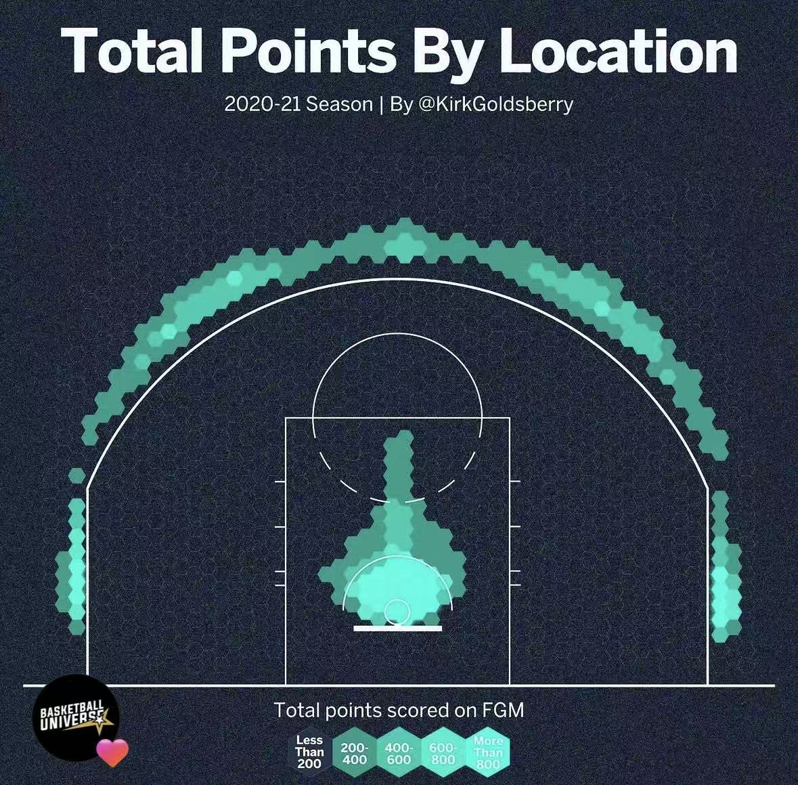
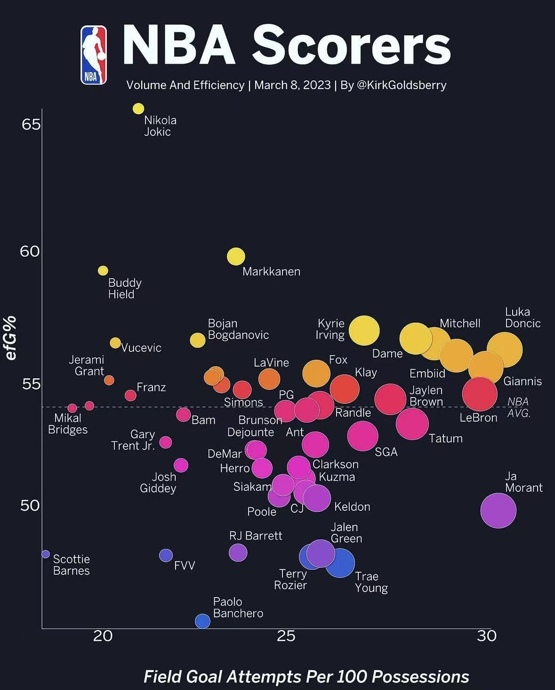
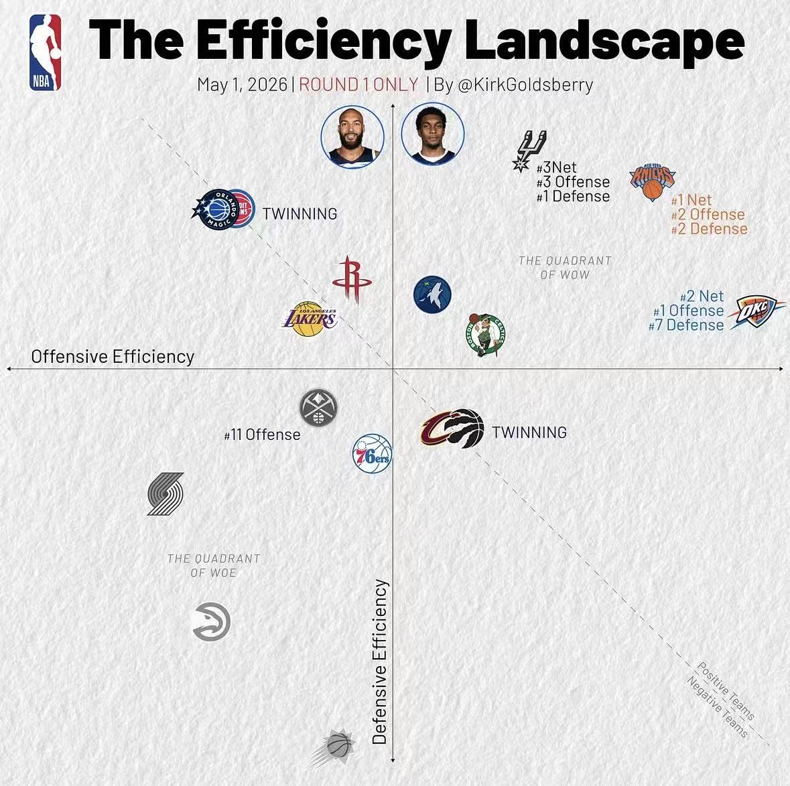
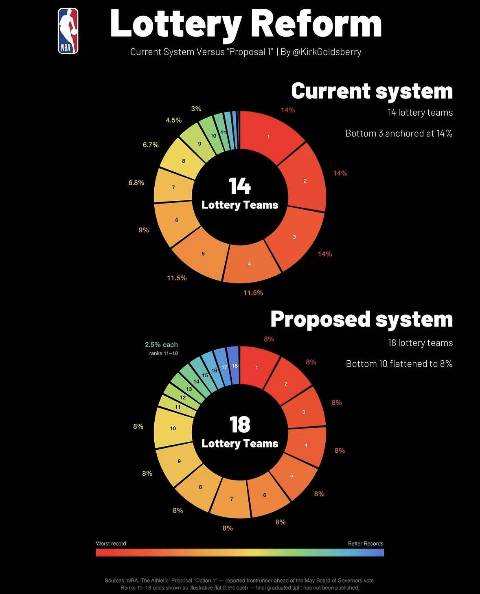
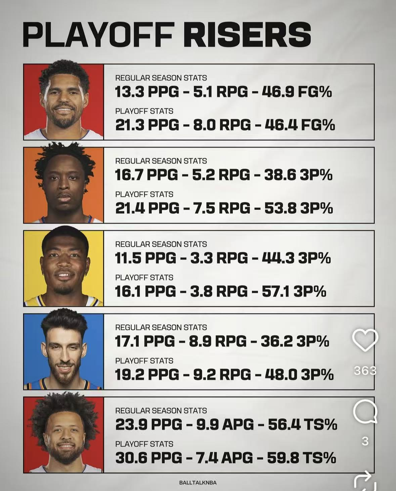

# Neo_Legend_Project


球场投射图：








双球场投射图

球场投射动态图gif


坐标图：


正负坐标图：


玫瑰图：


表格图：




根据上面的图形读取图形的样式，然后根据图形的布局使用Python绘制一个fast-api对外的接口，用于绘制图形。
要求1：在图形样式上要与图例中的保持一致，而且每种类型的图例分别生成对应独立的skills ，用来后期独立的控制skills，
要求2：生成全套的图例测试用例
要求3：自动选择绘制图例的组件，根据图例的类型自动选择对应的组件。
要求4：在接口中添加一个参数，用来指定要绘制的图例的类型。
要求5：在接口中添加一个参数，用来指定要绘制的图例的样式。

## 批量生成与调参日志

生成全部图例图片、模拟数据、参考图比对报告和调参日志：

```powershell
$env:PYTHONPATH='src'
python -m neo_legend.batch_generate --output-dir 'G:\echaet' --project-root 'E:\haochenkeji\Neo_Legend_Project'
```

输出内容：

- `G:\echaet\*.png` / `G:\echaet\*.gif`：每种图例样式的最终图片。
- `G:\echaet\raw\*`：未经自动后处理的原始渲染图片。
- `G:\echaet\logs\render_events.jsonl`：逐图例生成日志，包含请求参数、模拟数据摘要、图片指标、参考图比对和调参因子。
- `G:\echaet\logs\comparison_report.json`：结构化比对报告。
- `G:\echaet\logs\tuning_report.md`：人工微调用报告。

FastAPI 也提供 `POST /batch-generate` 用于从 Swagger 页面触发同样流程。
